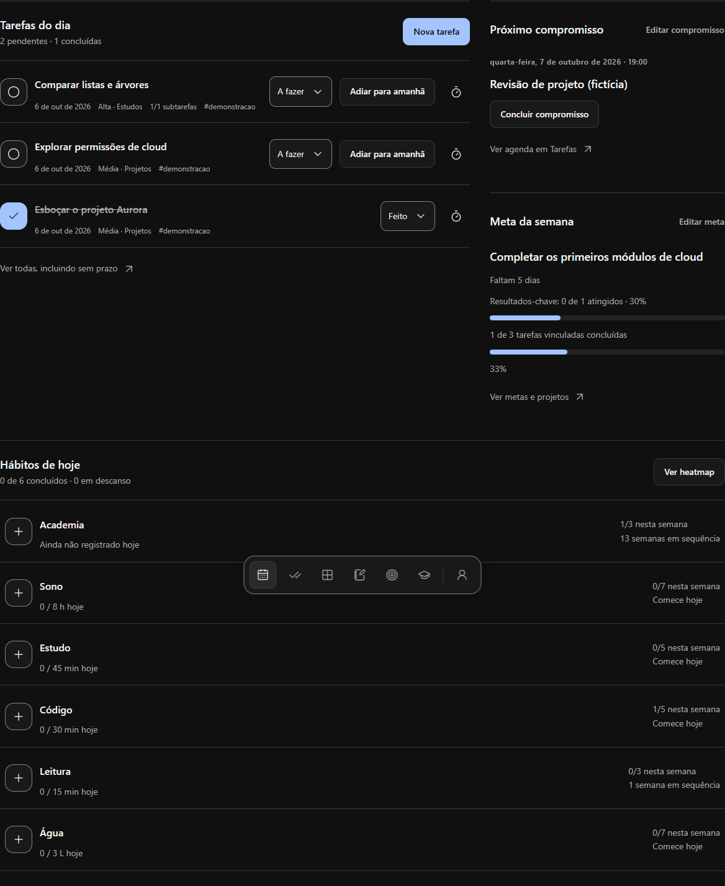
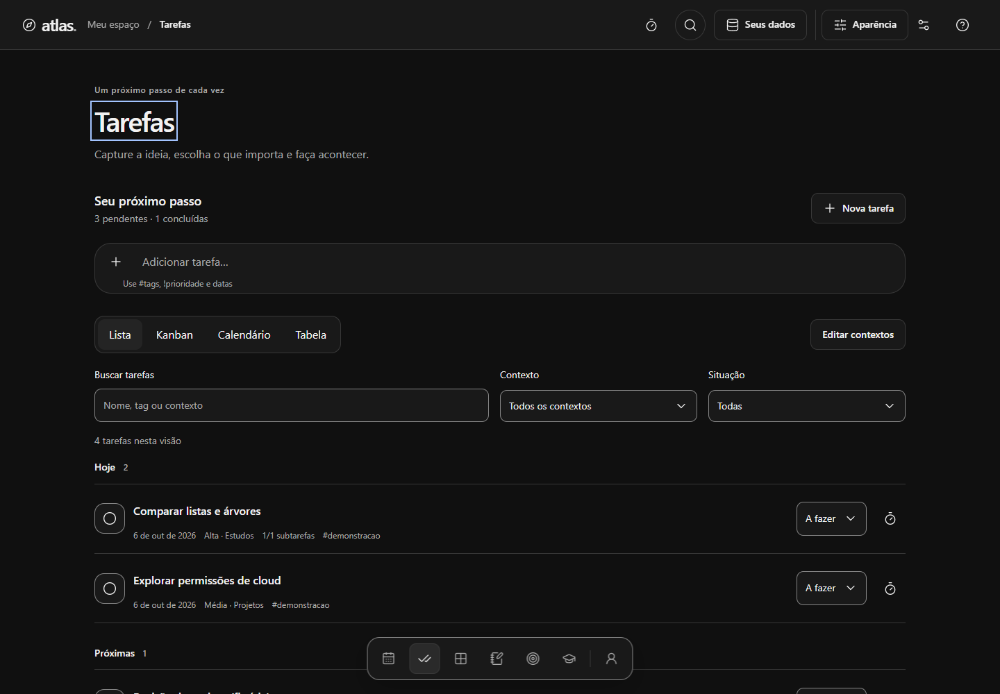
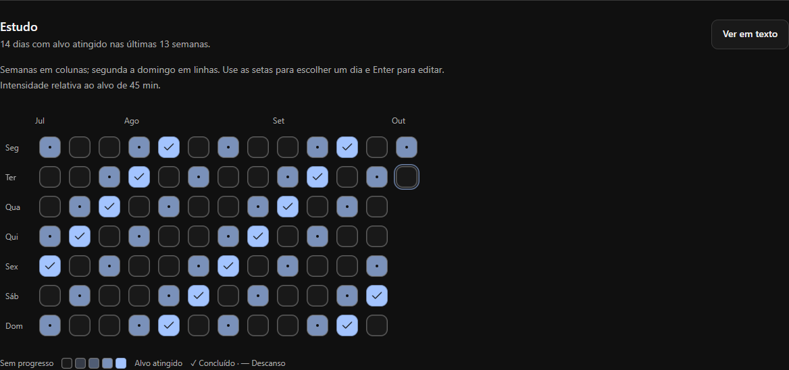
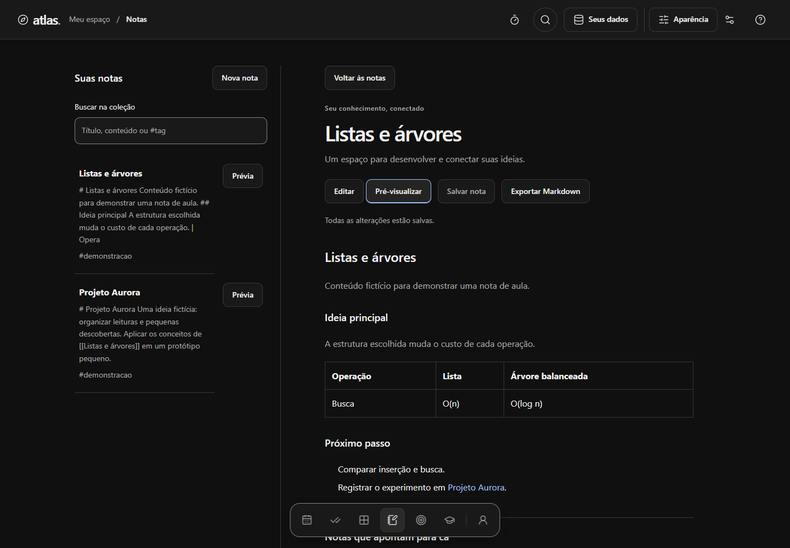
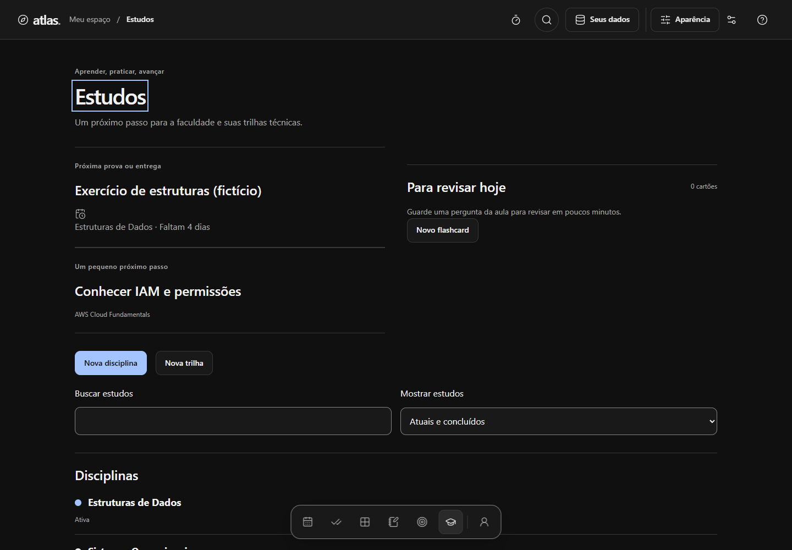
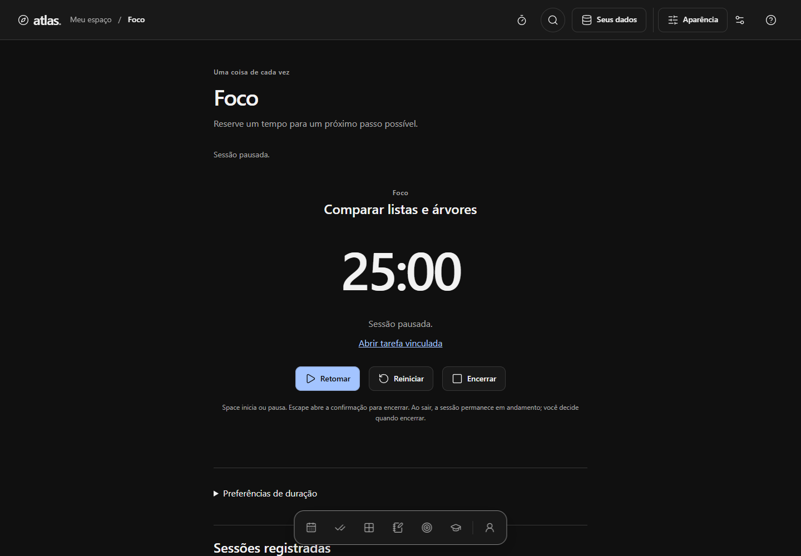
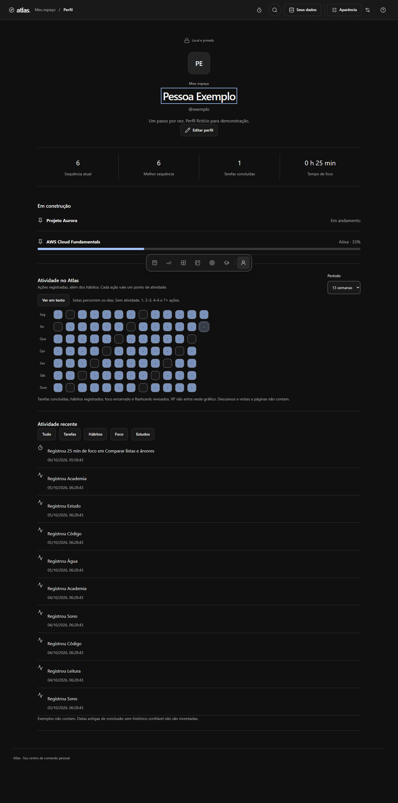

# Atlas

**Seu centro de comando pessoal: abre, anota, marca, pronto.**

O Atlas reúne tarefas, hábitos, notas, estudos, metas e projetos em uma estrutura pronta para preencher. A proposta é organizar a rotina sem manter uma ferramenta com configuração excessiva.

Esta é a primeira entrega de portfólio do projeto. O desenvolvimento deste escopo está congelado. A hospedagem de uso pessoal é protegida e **não é uma demo pública**; não há release/tag publicada informada aqui.

## Recursos implementados

| Área                  | O que existe no código                                                                                                                                             |
| --------------------- | ------------------------------------------------------------------------------------------------------------------------------------------------------------------ |
| Hoje                  | Tarefas do dia, revisão de pendências, hábitos, compromisso manual, meta semanal escolhida pelo usuário e widgets ocultáveis/reordenáveis por arraste ou teclado.  |
| Tarefas               | Captura em português com datas/hora/tags/prioridade, contextos editáveis, subtarefas/repetição; Lista, Kanban, Calendário e Tabela, com alternativa ao arraste.    |
| Hábitos               | Binários/quantitativos, frequência diária/semanal, descanso, sequências e heatmaps individual/geral com cinco níveis e alternativa textual.                        |
| Notas                 | Editor/prévia Markdown, quatro templates, tags/busca, [[links]], autocomplete/backlinks, preview por mouse ou ação explícita e importação local de .md.            |
| Metas e projetos      | Resultados-chave manuais, progresso complementar de tarefas, prazo/meta semanal; projetos com tarefas/notas/metas vinculadas por ID e links/repositório opcionais. |
| Estudos               | Disciplinas, avaliações, faltas, provas/entregas, tarefas vinculadas, trilhas/checklist e flashcards com versão pequena de SM-2.                                   |
| Foco                  | Foco/pausa curta/pausa longa, durações configuráveis, iniciar/pausar/retomar/encerrar e recuperação por timestamps. Conclusão exige intenção explícita.            |
| Perfil e preferências | Perfil/avatar local, atividade/heatmap, até três fixados; aparência, movimento/transparência, widgets, dados e XP discreto/ocultável.                              |

Exemplos vêm prontos e podem ser removidos. Ações destrutivas comuns têm confirmação e recuperação; **limpeza total não tem desfazer**. **Ctrl/Cmd+K** captura/busca; **?** abre atalhos fora de campos. O dock inferior inclui Perfil; no celular, **Mais** reúne Notas, Metas e Estudos. Preferências fica no cabeçalho junto a Aparência.

Captura: `estudar AWS amanhã 19h #faculdade !alta`. `nota: ideia de projeto` cria uma nota e abre o editor.

## Rodar localmente

Requisitos: Node 22.19+ na linha 22, ou 24+, npm e navegador com IndexedDB. Ambiente validado: Windows, Node 25.3.0, npm 11.6.2 e Microsoft Edge. Outras versões/dispositivos não foram todos testados.

```sh
npm ci
npm run dev
```

Abra a URL informada pelo Vite. Não é necessário arquivo de ambiente, API, backend ou login do Atlas. Para verificar o build e o PWA local:

```sh
npm run build
npm run preview -- --host 127.0.0.1 --port 4180 --strictPort
```

Saída do build: `dist/`. O PWA é ativado no build de produção, não no servidor de desenvolvimento. Hospedagem exige raiz do domínio e fallback SPA que diferencie rotas de assets inexistentes; nenhuma hospedagem é criada ao executar esses comandos.

| Comando | Finalidade |
| --- | --- |
| `npm run dev` | Desenvolvimento com Vite. |
| `npm run lint` | ESLint. |
| `npm run typecheck` | TypeScript estrito. |
| `npm run test` | Suíte unitária Vitest/Testing Library. |
| `npm run test:watch` | Testes unitários em modo de acompanhamento. |
| `npm run build` | Typecheck e build de produção. |
| `npm run preview` | Servir o build local. |
| `npm run test:e2e` | Playwright: fluxos reais, Axe, backup, offline e atualização. |
| `npm run icons` | Gerar ícones a partir da marca vetorial local. |
| `npm run format` | Formatar arquivos com Prettier; modifica os arquivos. |

Os E2E usam Microsoft Edge instalado, um worker e contextos descartáveis. Iniciam build/preview em 4180 se necessário. Deixe a porta livre e evite outro servidor durante a validação; não reconstrua `dist` durante a suíte. `ATLAS_TEST_URL` é uma opção de teste, não requisito do aplicativo. Artefatos gerados não fazem parte da entrega versionada.

## Stack e arquitetura

React 19, TypeScript 6, Vite 8, Tailwind CSS 4 com tokens CSS, Zustand, Dexie/IndexedDB, Zod, React Router, date-fns, Framer Motion, cmdk, Radix e Lucide. Markdown: react-markdown, remark-gfm, remark-parse e unified. Qualidade: Vitest, Testing Library, Playwright/Axe e Lighthouse. PWA: vite-plugin-pwa/Workbox. Versões exatas estão no lockfile.

`src/features` contém os módulos; `src/app` organiza shell/rotas/estado; `src/components` compartilha a UI; `src/lib` guarda regras puras; `src/data` separa repositories e persistência; `src/styles` contém os tokens. [Arquitetura](docs/ARCHITECTURE.md) e [decisões selecionadas](docs/DECISIONS.md).

## Dados, offline e backup

O conteúdo fica no IndexedDB; preferências gerais e rascunhos ficam no localStorage. **Computador e celular têm bancos separados, sem sincronização.** O Atlas não tem backend de conteúdo, analytics, login próprio ou envio de notas a serviços externos. Armazenamento local não é backup nem cofre criptografado.

Após o preparo online, recarga e recursos precacheados funcionam offline. Aguarde **“App preparado para recarga offline neste navegador.”** em Preferências. Atualizações oferecem **Atualizar** e **Agora não**. Salve outros formulários antes de atualizar; preservação de nota e timer foi exercitada por automação.

- **JSON:** conteúdo, IDs, relações, perfil/fixados, atividade e XP.
- **Markdown completo:** leitura humana com bloco JSON de restauração. Importar usa o bloco, não alterações feitas somente no texto legível.
- **Nota .md individual:** texto, [[links]], título, tags e arquivamento; não restaura o banco inteiro nem todas as relações.

Preferências gerais, rascunhos e undo ficam fora do backup atual. Salve as notas antes de exportar. Importação mescla registros sem sobrescrever IDs existentes. Origem/navegador/perfil diferente significa outro banco: faça backup antes de trocar de endereço. [Privacidade, limites e limpeza](docs/DATA-AND-PRIVACY.md).

## Capturas de apresentação

As sete capturas selecionadas usam somente identidade e registros fictícios, em navegador descartável. São capturas históricas da apresentação, anteriores à atualização da logo; não representam dados pessoais nem produtividade real. Hoje mostra um recorte de widgets, Hábitos mostra o heatmap. Não houve alteração da interface para favorecer as imagens.



<details>
<summary>Ver Tarefas, Hábitos, Notas, Estudos, Foco e Perfil</summary>








</details>

## Qualidade e limites

Os resultados da validação desta cópia estão em [VALIDATION](docs/VALIDATION.md). Os testes anteriores foram preservados; nomes pessoais de fixtures foram substituídos mantendo as asserções. Não existe badge de CI nem validação humana completa presumida.

Lighthouse histórico local mobile: frio **84 / 86 / 89, mediana 86**; retorno preparado **100 / 99 / 99, mediana 99**. LCP frio mediano **3,149 s**. Foram três execuções por cenário, em build de produção e perfil descartável, com configurações comparáveis. A meta fria ≥ 90 continua pendente. Estes números não são uma nova medição desta cópia ou do host protegido; nenhuma rodada adicional foi feita para esta entrega.

Backlog curto:

1. Performance mobile fria abaixo da meta 90.
2. Instalação física, NVDA, zoom nativo e dispositivos adicionais ainda sem evidência humana completa.
3. Arquivamento de hábitos.
4. Preferências gerais fora do backup atual.
5. Rastreabilidade exata da revisão do snippet de dock recebido e revisão completa dos avisos transitivos em futuras distribuições compiladas.

## Processo e licença

Desenvolvimento assistido por IA/Codex, com direção de produto, requisitos, revisões e decisões do autor. Código gerado e contagem de testes não são prova de domínio pessoal independente de todas as tecnologias. O [caso de portfólio](docs/PORTFOLIO-CASE-STUDY.md) descreve o processo e os resultados sem inventar adoção ou ganho de produtividade.

Código próprio sob [MIT](LICENSE), autorizada pelo titular. Licenças de terceiros permanecem aplicáveis: [procedência](docs/COMPONENT-PROVENANCE.md) e [avisos integrais](public/third-party-notices.txt). A marca fornecida para o Atlas e seus metadados de procedência foram preservados; não se atribui automaticamente autoria humana independente a assets gerados.
